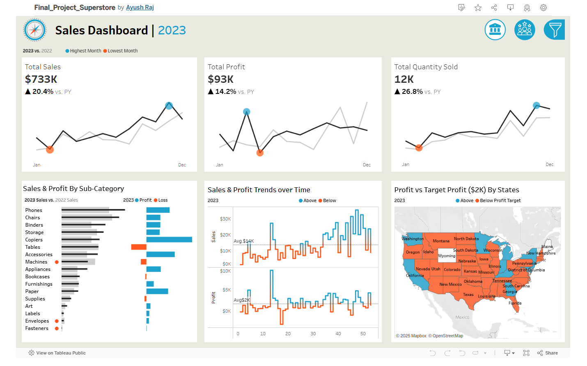
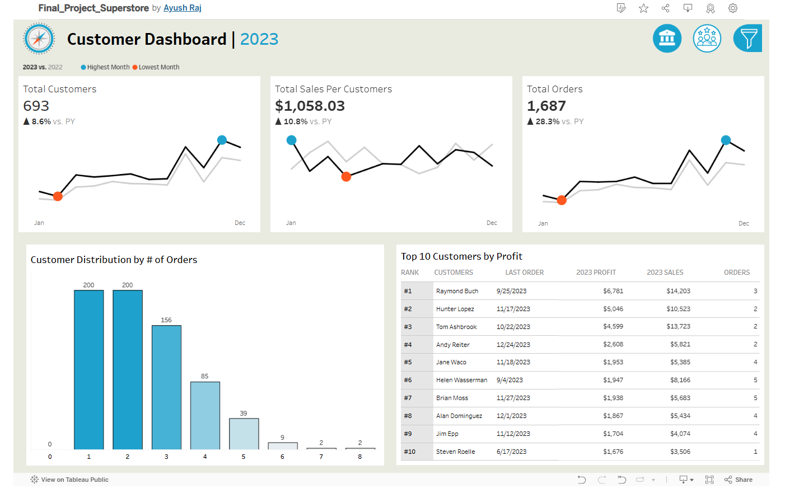

# Business Problem
Superstore faced challenges in achieving balanced growth across regions, product categories, and customer segments. While certain regions and products demonstrated strong sales and profitability, others underperformed, leading to inefficiencies and missed opportunities. Additionally, customer behavior analysis revealed gaps in retention and engagement, particularly in lower-performing segments.

## The primary issues included:

**Regional Disparities**: High-performing regions like California and New York drove most profits, whereas regions like Texas and Florida lagged behind in sales and profitability.
**Product Portfolio Inefficiencies**: Certain product categories, such as Office Supplies, exhibited low profit margins, pulling down overall profitability despite steady sales.
**Customer Engagement Gaps**: The Corporate segment generated high sales volume but suffered from higher return rates, impacting profitability, while other segments lacked targeted strategies to improve engagement.
**Inventory and Demand Alignment**: Frequent stockouts in high-demand product categories, particularly during peak seasons, resulted in lost revenue opportunities.

# Goal
*The goal of this Tableau project was to leverage data visualization and analysis to:*

* Identify and address performance gaps across regions, products, and customer segments.
* Enhance inventory management to better align with demand.
* Improve customer engagement and retention strategies to maximize lifetime value.
* Support data-driven decisions to boost profitability and achieve sustainable growth.

This comprehensive dashboard provides a unified view of business performance by combining sales metrics and customer insights. It enables a detailed analysis of sales trends, regional and product performance, and customer behavior. The dashboard highlights key metrics such as total sales, profit margins, customer segmentation, and purchasing patterns. By integrating sales and customer data, it offers actionable insights to drive revenue growth, optimize product offerings, and enhance customer engagement strategies.

# 1. Sales Dashboard

## Description:
The Sales Dashboard provides a comprehensive overview of sales performance across regions, product categories, and time. It highlights key metrics such as total sales, profit margins, sales by region, and product-level performance. Visualizations include bar charts, heatmaps, and trend lines to track sales growth, regional disparities, and product-level profitability.

### Key Findings:
Total Sales and Profit: Total sales amount to $2.3 million, with an overall profit margin of 10%.
Top Regions: California and New York are the highest-performing regions, contributing 40% of total profits.
Underperforming Regions: Texas and Florida exhibit lower sales and profitability, with higher return rates and lower customer engagement.
Category Performance: Technology leads in both sales and profit contribution (35% of total profit), while Office Supplies show steady sales but low profitability.
Seasonal Trends: Q4 demonstrates the highest sales due to seasonal promotions and holiday demand.

### Key Insights:
Regional Contribution: High-performing regions (California, New York) show significant profitability, likely driven by strong demand for technology products and better customer retention.
Product Category Discrepancies: High-margin technology items drive profitability, while certain subcategories like binders and paper in Office Supplies drag overall margins down.
Growth Opportunities: Low-performing regions like Texas have potential for growth through targeted promotions or optimized inventory.

### Recommendations:
Regional Focus: Invest more in marketing and promotions in high-performing regions (California, New York) to capitalize on existing demand. Develop region-specific campaigns to boost sales in Texas and Florida.
Product Optimization: Discontinue or bundle low-margin Office Supplies items like binders and paper to increase profitability.
Seasonal Preparation: Stockpile inventory for high-demand categories (e.g., laptops and accessories) ahead of Q4 to meet customer demand without stockouts.
Pricing Strategies: Reassess pricing for high-demand items in Technology to maintain competitiveness while maximizing profit margins.

# 2. Customer Dashboard

## Description:
The Customer Dashboard focuses on customer segmentation and purchasing behavior. It includes metrics like customer lifetime value (CLV), purchase frequency, sales by customer segment, and profit contribution. Visualizations such as pie charts, line graphs, and tables provide insights into customer demographics and loyalty.

### Key Findings:
Customer Segments: The Consumer segment generates the highest profit margins, while Corporate clients drive the highest sales volumes.
Profitability by Segment: The Home Office segment lags behind both Consumer and Corporate segments in profitability.
Customer Retention: High-value customers in the Consumer segment exhibit higher retention rates and purchase frequency.
Return Rates: The Corporate segment has a slightly higher return rate, impacting overall profitability.

### Key Insights:
Segment Profitability: Consumer customers contribute to higher margins, making them a critical segment for sustained growth.
Corporate Challenges: Corporate clients generate volume but face challenges like higher return rates and lower profitability.
Retention Opportunities: High-value customers in the Consumer segment could be further incentivized to increase purchase frequency and lifetime value.

### Recommendations:
Customer Loyalty Programs: Implement a loyalty program for the Consumer segment to increase repeat purchases and strengthen relationships with high-value customers.
Retention Strategies for Corporate Clients: Address the root causes of high return rates among Corporate clients by improving product quality assurance or refining the sales process.
Segment-Specific Campaigns: Tailor marketing campaigns for the Home Office segment to boost engagement and profitability. For example, offer discounts on technology bundles suited to small businesses.
Customer Insights: Use dashboard data to identify trends among top customers and create personalized experiences to enhance loyalty and satisfaction.
